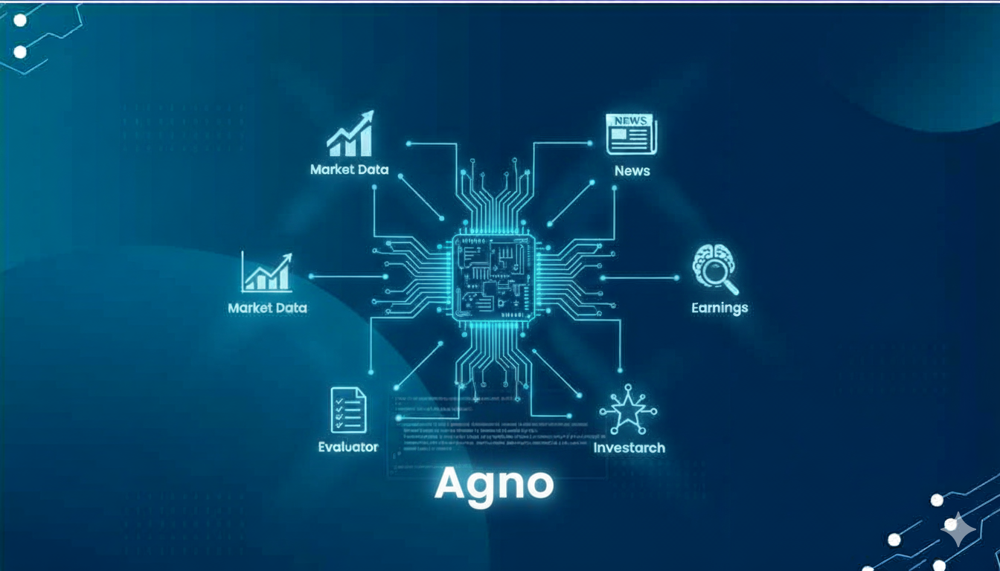

# Multi-Agent Financial Analysis System

<p align="center">
  
</p>

---
A comprehensive financial analysis system powered by agentic AI using the Agno platform.

## 🎯 Project Overview

This project implements a multi-agent financial analysis system that demonstrates autonomous agent functions and workflow patterns required for modern financial analysis. The system uses specialized AI agents to analyze market data, news sentiment, earnings reports, and provide investment recommendations.


## 📋 Project Requirements

### Agent Functions
- ✅ **Planning**: Agents plan research steps for given stock symbols
- ✅ **Dynamic Tool Usage**: Agents use APIs, datasets, and retrieval tools dynamically
- ✅ **Self-Reflection**: Agents assess the quality of their output
- ✅ **Learning**: Agents maintain memory and improve across runs

### Workflow Patterns
- ✅ **Prompt Chaining**: Ingest News → Preprocess → Classify → Extract → Summarize
- ✅ **Routing**: Direct content to appropriate specialists (earnings, news, market analyzers)
- ✅ **Evaluator–Optimizer**: Generate analysis → evaluate quality → refine using feedback

documentation

## 🏗️ Project Structure

```
Multi_Agent_Financial_Analysis_System/
├── agents/                              # AI Agent implementations
│   ├── investment_research_agent.py    # Main orchestrator
│   ├── earnings_agent.py              # Financial filings analysis
│   ├── news_agent.py                  # News analysis and sentiment
│   ├── memory_agent.py                # Context retention
│   ├── market_data_agent.py           # Market data fetching
│   └── evaluator_agent.py             # Quality assessment
├── tools/                              # API integration tools
│   ├── yahoo_finance_tools.py         # Yahoo Finance API
│   ├── news_api_tools.py             # NewsAPI integration
│   ├── sec_edgar_tools.py            # SEC EDGAR API
│   └── fred_tools.py                  # FRED economic data
├── workflows/                          # Workflow pattern implementations
│   ├── prompt_chaining.py            # News processing pipeline
│   ├── routing.py                    # Content routing
│   └── evaluator_optimizer.py        # Quality refinement
├── utils/                              # Utility functions
├── Investment_Research_Agent.ipynb     # Main deliverable notebook
├── requirements.txt                    # Python dependencies
└── README.md                          # Project documentation
```

## 🚀 Getting Started

### Prerequisites
- Python 3.10+
- Google API Key (for Gemini model)
- NewsAPI Key (optional)
- FRED API Key (optional)

### Installation
1. Clone the repository
2. Install dependencies: `pip install -r requirements.txt`
3. Set up environment variables in `.env` file
4. Run the main notebook: `jupyter notebook Investment_Research_Agent.ipynb`

### Environment Setup
Create a `.env` file with the following variables:
```
GOOGLE_API_KEY=your_google_api_key_here
NEWSAPI_KEY=your_newsapi_key_here
FRED_API_KEY=your_fred_key_here
```

## 🔧 Technology Stack

- **Agno Platform**: Multi-agent framework
- **Google Gemini**: Large language model
- **Yahoo Finance**: Market data
- **NewsAPI**: Financial news
- **SEC EDGAR**: Company filings
- **FRED**: Economic data
- **SQLite**: Agent memory storage
- **Jupyter Notebooks**: Documentation and execution

## 📊 Agent Capabilities

### Investment Research Agent
- Plans comprehensive research workflows
- Orchestrates other agents
- Synthesizes analysis from multiple sources
- Provides investment recommendations

### Earnings Agent
- Analyzes financial filings and earnings reports
- Extracts key financial metrics
- Identifies trends and patterns
- Assesses financial health

### News Agent
- Fetches and analyzes financial news
- Performs sentiment analysis
- Extracts key information
- Provides news-based insights

### Memory Agent
- Maintains context across sessions
- Stores and retrieves analysis history
- Enables learning and improvement
- Provides persistent memory

### Market Data Agent
- Fetches real-time market data
- Processes technical indicators
- Analyzes market trends
- Provides market insights

### Evaluator Agent
- Assesses analysis quality
- Provides constructive feedback
- Enables iterative improvement
- Implements quality control

## 🔄 Workflow Patterns

### 1. Prompt Chaining
```
Raw News → Preprocessing → Classification → Entity Extraction → Summarization
```

### 2. Routing
```
Content Analysis → Specialist Selection → Agent Routing → Specialized Analysis
```

### 3. Evaluator-Optimizer
```
Initial Analysis → Quality Evaluation → Feedback Generation → Refined Analysis
```

## 📈 Usage Examples

### Basic Analysis
```python
from agents.investment_research_agent import investment_research_agent

# Analyze a stock symbol
analysis = investment_research_agent.run("AAPL")
print(analysis.content)
```

### Workflow Pattern Demonstration
```python
from workflows.prompt_chaining import news_processing_pipeline
from workflows.routing import route_content
from workflows.evaluator_optimizer import evaluator_optimizer_workflow

# Demonstrate prompt chaining
news_analysis = news_processing_pipeline(news_data)

# Demonstrate routing
specialist_analysis = route_content("earnings", earnings_data)

# Demonstrate evaluator-optimizer
refined_analysis = evaluator_optimizer_workflow("AAPL")
```

## 🧪 Testing

Run individual agents:
```bash
python agents/investment_research_agent.py
python agents/earnings_agent.py
python agents/news_agent.py
python agents/memory_agent.py
```

## 📄 License

This project is licensed under the MIT License.


---

**Multi-Agent Financial Analysis System**